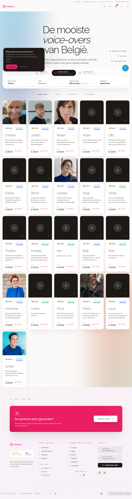
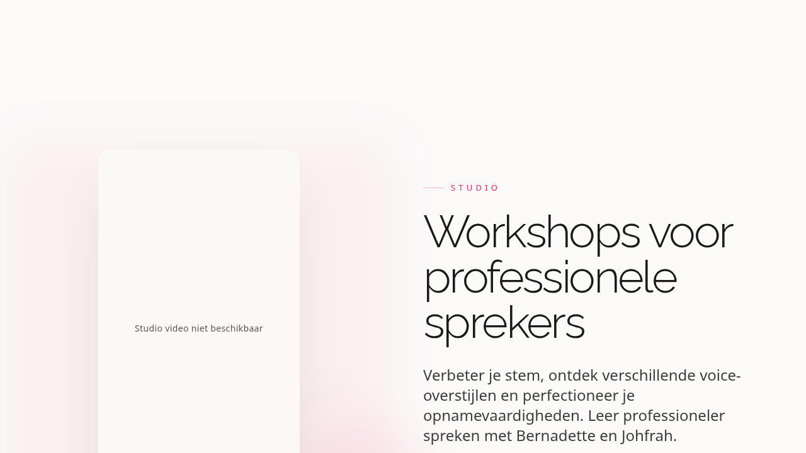
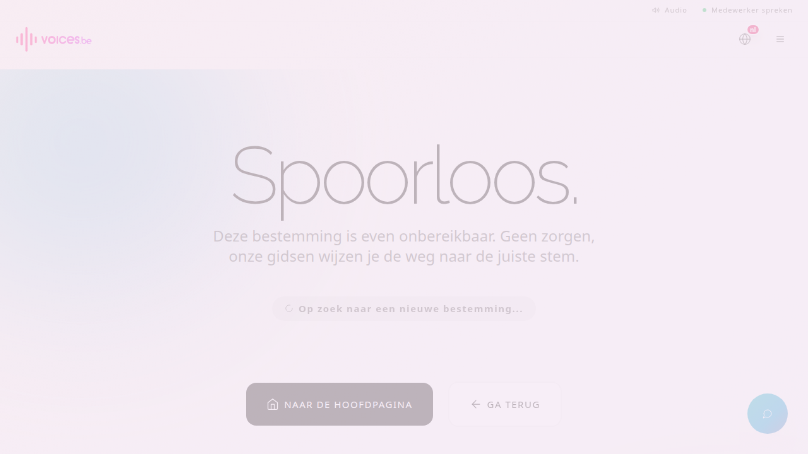
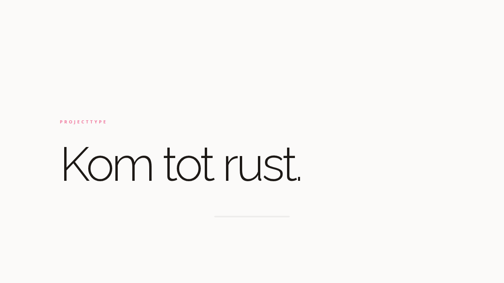
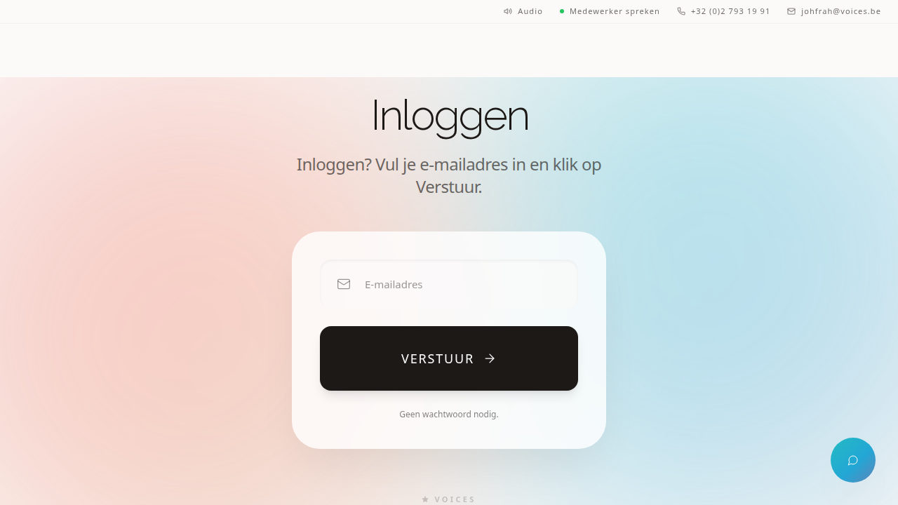

# Voices Continuity Handbook
## Voor totale beginners die het bedrijf moeten overnemen

Versie: 1.0  
Doelgroep: partner, familie, vertrouwenspersoon, nieuwe operations lead  
Context: dit document is geschreven voor een noodscenario waarin de founder plots uitvalt.

---

## Hoe je dit document gebruikt

Lees dit handboek in drie lagen:

1. Lees eerst hoofdstuk 1 tot 4 in één zit.
2. Gebruik hoofdstuk 5 tot 11 als dagelijks werkboek.
3. Gebruik hoofdstuk 12 tot 15 alleen bij incidenten, publicaties en risico.

Als je maar 15 minuten hebt:

- Open hoofdstuk 2 (kritieke toegang)
- Open hoofdstuk 5 (dagstart)
- Open hoofdstuk 12 (noodprotocol)

---

## 1) Wat Voices is in gewone mensentaal

Voices is geen klassieke website.  
Voices is een ecosysteem met meerdere werelden die elk een eigen doel hebben.

De kern:

- Je verkoopt stemmen, beleving, opleidingen en creatieve diensten.
- Alles draait op één technische motor met meerdere ingangen.
- De database is de bron van waarheid.
- De website toont alleen wat in de brondata als actief staat.

Belangrijk om te onthouden:

- Niet gokken.
- Niet improviseren op technische kernlogica.
- Altijd werken met checklists.

---

## 2) Kritieke toegang en continuïteit

In een noodscenario wil je niet technisch slim zijn.  
Je wil veilig en voorspelbaar werken.

### 2.1 Prioriteit van toegang

Volg deze volgorde:

1. E-mailtoegang (zakelijke mailbox)
2. Wachtwoordmanager (indien aanwezig)
3. Hosting/deployment toegang
4. Database en backend toegang
5. Facturatie en betalingen

### 2.2 Wie je eerst contacteert

1. Technische lead
2. Operations/Studio lead
3. Financiële verantwoordelijke
4. Legal/security

### 2.3 Wat je nooit als beginner doet

- Geen database tabellen aanpassen zonder specialist.
- Geen productie deployment pushen zonder pre-flight.
- Geen prijswijzigingen doen zonder financieel akkoord.
- Geen users of rechten verwijderen zonder incidentdossier.

---

## 3) Overzicht van alle Worlds

Dit is je stuurkaart.  
Gebruik deze tabel in elke weekmeeting.

| World ID | World | Doel | Primair kanaal |
|---|---|---|---|
| 0 | Foyer | Algemene toegang, contact en voorwaarden | `/contact`, `/terms` |
| 1 | Agency | Stemopdrachten en voice-over business | `voices.be`, `/agency` |
| 2 | Studio | Studio-activiteiten, inschrijvingen, productie | `/studio` |
| 3 | Academy | Opleidingen en leertrajecten | `/academy` |
| 5 | Portfolio | Freelance en creatief portfolio | `johfrah.be` |
| 6 | Ademing | Meditatieve/ademing journeys | `/ademing` |
| 7 | Freelance | Technische en creatieve freelance-diensten | `/freelance` |
| 8 | Partner | Partnership, B2B en samenwerkingen | `/partners` |
| 10 | Johfrai | AI-gerelateerde world en journeys | `/johfrai` |
| 25 | Artist | Artist releases, profiel en donaties | `/artist` |

Werkregel:

- Elke wereld heeft een eigenaar.
- Elke eigenaar rapporteert wekelijks op KPI, risico en next action.

---

## 4) Frontoffice en backoffice in één beeld

### Frontoffice

Alles wat de bezoeker ziet:

- Publieke pagina's
- Landingspagina's
- Inschrijvingsflows
- Content en conversie

### Backoffice

Alles wat intern beheerd wordt:

- Admin
- Backoffice
- Accountzones
- Operationele data

### Belangrijk verschil

Frontoffice verkoopt vertrouwen.  
Backoffice bewaakt waarheid en uitvoering.

---

## 5) Dagelijkse besturing voor beginners

Doe elke werkdag dit ritme.

### 5.1 Dagstart (30 minuten)

1. Open incidentenlijst.
2. Controleer nieuwe leads en berichten.
3. Check lopende opdrachten en deadlines.
4. Check betaalstatus en blokkades.
5. Beslis top 3 prioriteiten van de dag.

### 5.2 Middagblok (90 minuten)

1. Publiceer of plan content.
2. Volg commerciële kansen op.
3. Los blokkades op in productieflow.
4. Escaleer technische issues meteen.

### 5.3 Eindsluiting (20 minuten)

1. Wat is af?
2. Wat blokkeert?
3. Welke risico's gaan mee naar morgen?
4. Welke drie acties liggen klaar voor morgen?

---

## 6) Wekelijkse besturing

Plan één vaste meeting van 60 minuten.

Agenda:

1. Omzet en cashflow
2. Leads naar opdrachten
3. Leveringen en kwaliteit
4. Klanttevredenheid
5. Risico en compliance
6. Beslissingen voor volgende week

Uitkomst:

- Elke world heeft één duidelijke owner action.
- Elke owner action heeft een deadline.
- Elke deadline heeft een meetbaar resultaat.

---

## 7) KPI-set voor een niet-technische bestuurder

Gebruik geen 40 metrics.  
Gebruik er 12, elke week opnieuw.

### Commercieel

- Nieuwe leads
- Conversieratio lead naar opdracht
- Gemiddelde orderwaarde

### Operationeel

- Doorlooptijd per opdracht
- Open tickets ouder dan 7 dagen
- Deadline hit-rate

### Kwaliteit

- Herwerkpercentage
- Klachtvolume
- NPS/tevredenheid

### Financieel

- Omzet deze maand versus vorige maand
- Openstaande facturen
- Cash runway in maanden

---

## 8) Workflow van grondstof tot live

Gebruik dit als bronproces, niet als theorie.

1. Ruwe input komt binnen (tekst, assets, briefing).
2. Content wordt gezuiverd en geformatteerd.
3. Data wordt in de juiste bron opgeslagen.
4. Frontoffice haalt data op en toont die.
5. Publicatie gaat via gecontroleerde release.
6. Live-validatie gebeurt met checklist.

Stopregel:

- Als een stap niet helder is, ga niet door.
- Escaleer naar specialist en log het incident.

---

## 9) De belangrijkste dashboards

### `/admin` (Directiekamer)

Gebruik dit voor:

- Overzicht
- Kritieke instellingen
- Monitoring
- Beslissingen op directieniveau

### `/backoffice` (Operationele motor)

Gebruik dit voor:

- Productie en beheer
- Verwerking van interne taken
- Projectmatige opvolging

### `/account` (klant en partner)

Gebruik dit voor:

- Klantcontext
- Partnercontext
- Veilige opvolging per relatie

---

## 10) Rollen en escalaties

Werk met deze simpele matrix:

- **R** Responsible: voert uit
- **A** Accountable: eindverantwoordelijk
- **C** Consulted: geeft input
- **I** Informed: blijft op de hoogte

Minimum per kritieke flow:

- Sales/Lead flow: R sales, A operations, C marketing, I finance
- Productieflow: R operations, A operations lead, C tech, I sales
- Tech release: R tech, A tech lead, C operations, I directie
- Betalingen: R finance, A finance lead, C legal, I directie

---

## 11) Veilig publiceren en wijzigen

Als beginner werk je met drie verkeerslichten.

### Groen

- Tekstcorrecties
- Planning
- Interne opvolging

### Oranje

- Nieuwe pagina live zetten
- Grote contentwissel
- Prijsaanpassingen

### Rood

- Database wijzigingen
- Productie deploy zonder check
- Rechten en toegang op kernsystemen

In oranje of rood:

- Nooit alleen beslissen.
- Altijd tweede paar ogen.

---

## 12) Incidenten en noodprotocol

Als iets misloopt, volg dit script.

### Eerste 10 minuten

1. Beschrijf probleem in 1 zin.
2. Noteer impact (wie, wat, hoeveel).
3. Stop risicovolle acties.
4. Informeer de juiste owner.

### Eerste 30 minuten

1. Start incidentlog.
2. Zet tijdelijke mitigerende maatregel.
3. Communiceer status intern.
4. Bepaal herstelverantwoordelijke.

### Na stabilisatie

1. Postmortem zonder schuldcultuur.
2. Beslis structurele fix.
3. Update checklist zodat fout niet terugkomt.

---

## 13) Financiële en juridische basiszorg

Elke week:

- Openstaande facturen controleren
- Inkomende betalingen matchen
- Contractstatus en verplichtingen checken
- BTW en boekhoudflow valideren

Elke maand:

- Winst- en cashoverzicht
- Top 10 risico's
- Beslissingen documenteren

Nooit doen:

- Mondelinge uitzonderingen zonder schriftelijke bevestiging.
- Prijsafspraken zonder spoor in CRM of contract.

---

## 14) Communicatie met klanten in stressmomenten

Gebruik deze structuur:

1. Erkenning: "We zien het probleem."
2. Impact: "Dit is de concrete impact."
3. Plan: "Dit doen we nu."
4. Tijd: "Volgende update om [tijd]."
5. Verantwoordelijke: naam en kanaal.

Houd taal simpel, warm en direct.  
Vermijd jargon in klantcommunicatie.

---

## 15) 90-dagen overnameplan

### Dag 1 tot 7

- Stabiliteit boven groei
- Toegang en processen veilig zetten
- Dagelijkse ritmes invoeren

### Week 2 tot 4

- Wereld per wereld begrijpen
- KPI-dashboard op orde krijgen
- Teamrollen scherp zetten

### Maand 2 en 3

- Optimaliseren
- Delegatie verbeteren
- Groeiplan opnieuw activeren

Resultaat na 90 dagen:

- Geen operationele chaos
- Beslisritme staat
- Team kan zelfstandig draaien

---

## Screenshot bijlage: front en back context

### Frontoffice voorbeelden

Voices homepage  

Agency context  

Studio context  

Academy context  

Ademing context  

### Backoffice ingangen

Admin ingang  

Backoffice ingang  

Account ingang  

Opmerking:

- Deze screenshots tonen de toegangs- of contextlaag.
- Detailschermen achter login worden best aangevuld met interne screenshots zodra je partner toegang heeft.

---

## Snelle noodchecklist op één pagina

1. Is toegang veilig?
2. Draait sales-opvolging?
3. Draait productieflow?
4. Zijn betalingen onder controle?
5. Zijn er kritieke incidenten?
6. Is er één verantwoordelijke per issue?
7. Is de volgende statusupdate gepland?

Als je 5 of meer keer "ja" hebt, zit je op koers.  
Als je 3 of minder keer "ja" hebt, schaal direct op.

---

## Slot

Je hoeft niet alles te kennen om Voices goed te besturen.  
Je moet vooral ritme, duidelijkheid en discipline houden.

Werk klein, werk helder, werk met bewijs.  
Dan blijft het bedrijf stabiel, zelfs in een moeilijke overgang.
